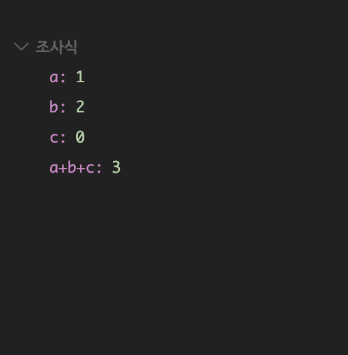

# Breakpoint 란?
**중단점**이라고도 한다. 디버깅 시 특정 라인을 breakpoint로 지정하면, 해당 라인 직전까지 코드를 실행한다.

# Watch 사용법
**조사식**이라고도 한다. 디버깅 시 여러 변수들을 한번에 확인할 수 있다.  
[VScode Debugging](https://code.visualstudio.com/docs/editor/debugging)  
  
{: width:"20%"}

# Call stack 의 의미
자바스크립트에서는 함수를 실행하면, 해당 함수의 기록을 Stack의 맨위에 추가한다. (접시를 쌓듯이) **Push**
함수 결과값을 반환하면 Stack에 쌓인 함수는 제거된다. **Pop**

# Step over / Step into / Step out